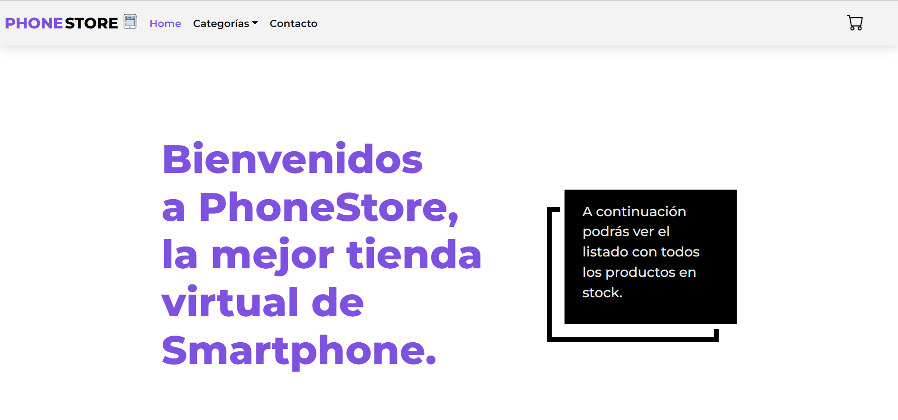
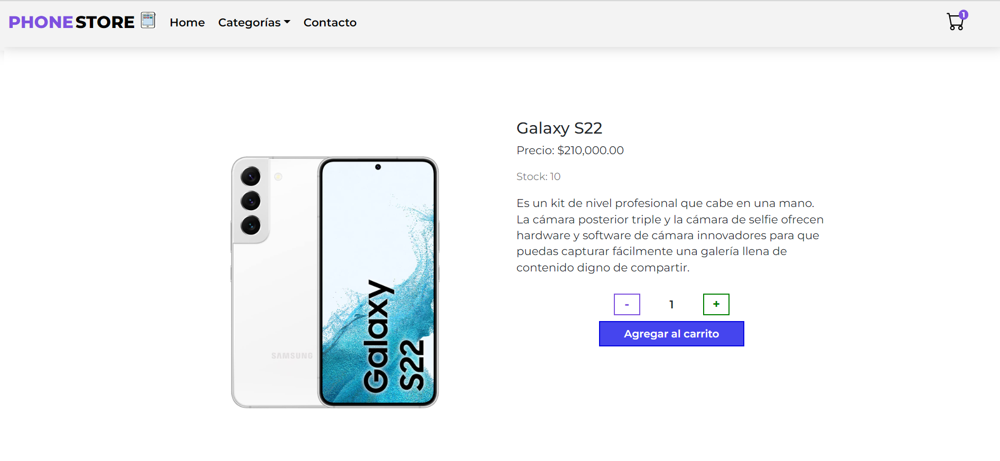

# Phone Store
## Proyecto para curso de ReactJS
Phone Store es un e-commerce de celulares.

El sitio es una SPA (Single Page Application).
Cuenta con diseño responsivo para pc, tablet y móvil.

## Estructura:
### Menu de Navegación
- Home.
- Categorías.
- Contacto.

### Home
En esta vista se encuentra un saludo de bienvenida y todos los productos de la tienda 

### Categorías
En cada vista se muestran solo los productos correspondientes a la categoría seleccionada.

### Contacto
Formulario para enviar consultas. Su funcionamiento actualmente simula el comportamiento de un formulario real.

### Cart
En esta vista se muestran los productos seleccionados por el usuario para ser adquiridos.

### Detalles de producto
Haciendo click en el botón "+ Info" de cada producto accedemos a la vista con todos las especificaciones de ese producto particular.

## Instalación
- Clonar el repositorio con el comand git clone (url del gh del proyecto).
- En el directorio raiz del proyecto correr el comando npm install para instalar todas las dependencias del proyecto.
- Usar npm start para correr la app y verla en el navegador. Se abrirá http://localhost:3000. La página se recargará cada vez que se haga un cambio. Pueden visualizarse los errores por consola.

## Para ver el sitio
- Ir al repo [hacé clik aquí](https://github.com/gisebag/phone-store-React.git)
- Deploy [hacé clik aquí](https://smartphone-store-reactjs.netlify.app/)

> Dependencias y tecnologías
- React.
- Javascript.
- Vanilla CSS para dar estilo al proyecto.
- Bootstrap para la estructura del navbar.
- React Router Dom para la navegación.
- Sweetalert2. 
- Firebase.

